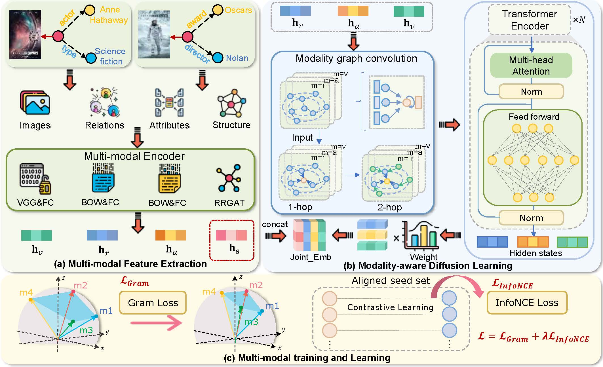

# MyGram

The code of paper _**MyGram: Modality-aware Graph Transformer with Global Distribution for Multi-modal Entity Alignment**_.

<div align="center">
    
</div>

## Datasets
- **Cross-KG datasets**: The original cross-KG datasets (FB15K-DB15K/YAGO15K) comes from [MMKB](https://github.com/mniepert/mmkb).
- **Bilingual datasets**: The multi-modal version of DBP15K dataset comes from the [EVA](https://github.com/cambridgeltl/eva).

## Train
- **How to run**: Using script file
```
bash run.sh
```
